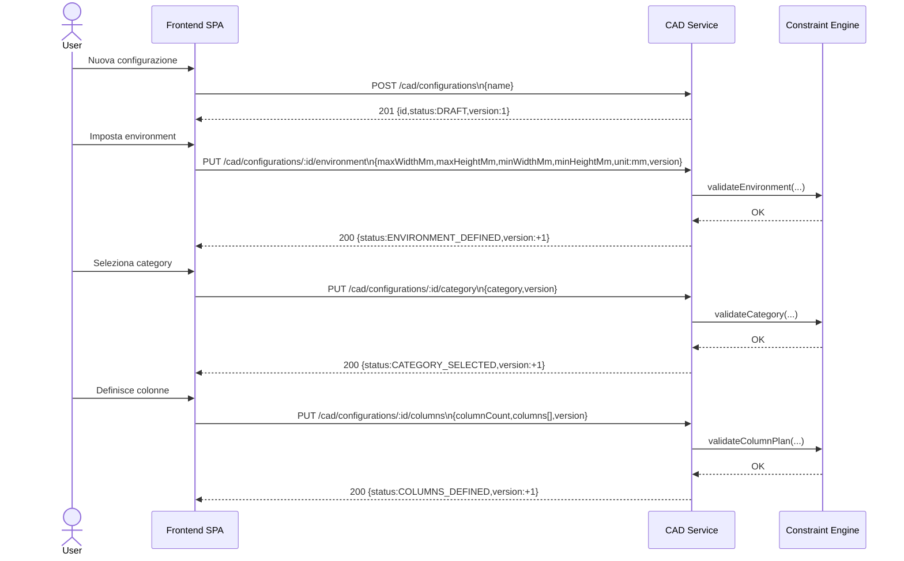
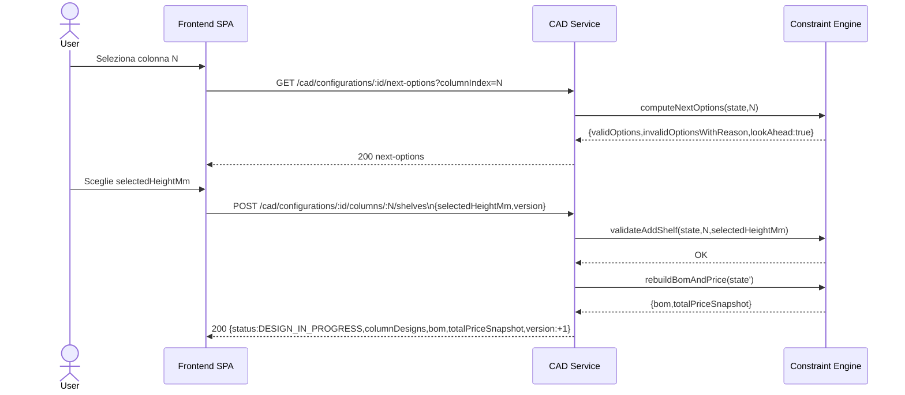
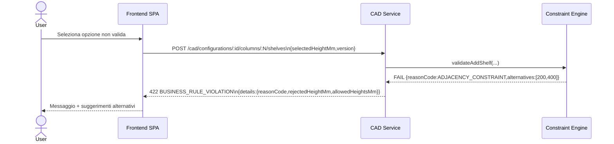
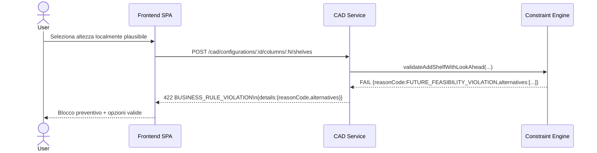
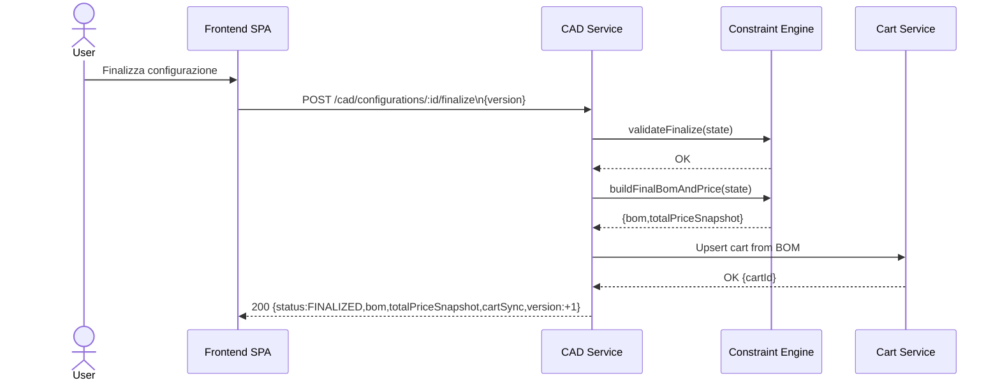
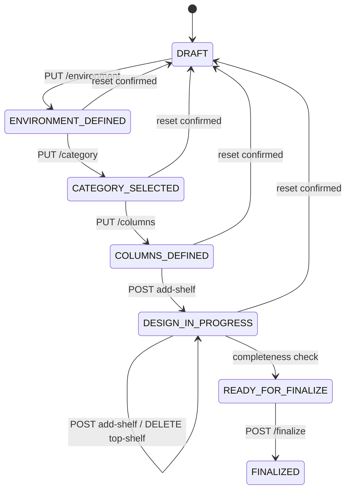

Perfetto Valerio — hai fatto un lavoro **davvero solido e professionale**: le tue risposte chiudono praticamente tutte le ambiguità critiche.  
A questo punto posso generare per te il **documento definitivo completo delle viste della SPA KompozeR**, già:

* coerente con backend
* pronto per essere inserito nel progetto
* strutturato per evoluzione futura (sequence diagram + wireframe)

***

# 📘 KOMP OZ ER — SPECIFICA DETTAGLIATA DELLE VISTE (v1)

***

# 1. INTRODUZIONE

## 1.1 Obiettivo

Questo documento descrive in modo completo e dettagliato le viste della SPA KompozeR, con focus su:

* struttura UI
* comportamento utente
* vincoli UX
* integrazione con backend

***

## 1.2 Principi progettuali

* Architettura SPA con routing
* Workflow guidato e vincolato (CAD)
* Backend autoritativo sulle regole
* UX preventiva (no errori a posteriori)
* Coerenza visiva e comportamentale tra tutte le viste

***

# 2. LAYOUT CONDIVISO

## 2.1 Struttura globale

```
HEADER
NAVIGAZIONE
CONTENUTO
```

***

## 2.2 Header

Elementi:

* Logo KompozeR
* Navigazione principale:
  * Catalogo
  * CAD
  * Configurazioni
  * Carrello
  * Admin (solo utenti autorizzati)
* Icona notifiche (🔔 con badge)
* Stato utente (avatar / login)

***

## 2.3 Notifiche globali

Due livelli:

### Realtime

* Toast popup
* Dropdown da campanella

### Persistente

* Vista `/notifications`

***

# 3. VISTA `/` — ACCESSO

## Obiettivo

Gestione autenticazione e accesso guest

***

## Componenti

* Form login
* Form registrazione
* Pulsante “Continua come guest”

***

## Comportamenti

* Guest:
  * può usare CAD
  * NON può salvare configurazioni
* Utente autenticato:
  * accesso completo

***

# 4. VISTA `/catalog` — CATALOGO

## Obiettivo

Esplorazione componenti

***

## Componenti

* Barra ricerca
* Filtri categoria
* Griglia prodotti
* Pulsante “Aggiungi al carrello”

***

## UX

* card modulari
* design pulito
* interazione veloce

***

# 5. VISTA `/cart` — CARRELLO

## Obiettivo

Revisione e checkout

***

## Layout

Due colonne:

* lista articoli
* riepilogo prezzo

***

## Comportamenti

* aggiornamento quantità
* totale dinamico
* CTA checkout

***

# 6. VISTA `/cad` — CONFIGURATORE

# 🔥 CORE DEL SISTEMA

***

## 6.1 Paradigma UX

* step obbligati
* nessun errore possibile
* backend-driven (next-options)

***

## 6.2 Layout desktop

```
STEP BAR

┌──────────────┬──────────────────────┬─────────────────┐
│ CONTROLLI     │ CANVAS              │ BOM / PREZZO    │
│               │ (griglia 2D)        │                 │
└──────────────┴──────────────────────┴─────────────────┘
```

***

## 6.3 Step workflow

### STEP 1 — Environment

#### Input

* larghezza (cm)
* altezza (cm)

#### Vincoli

* min/max da catalogo

#### UX

* input libero validato
* visualizzazione area
* cambio → reset con conferma

***

### STEP 2 — Category

* TONDO
* QUADRO
* KUBE

#### UX

* selezione card
* cambio → reset

***

### STEP 3 — Column Plan

#### Elementi

* numero colonne
* larghezza per colonna

#### UI

* selezione direttamente sulla griglia
* dropdown sopra ogni colonna

```
| Col 1 | Col 2 | Col 3 |
 800      600      800
```

***

#### Regole

* colonne NON devono riempire tutta la larghezza
* ordine fisso
* valori da catalogo

***

### STEP 4 — DESIGN

## ⚙️ Struttura

* ogni colonna = stack verticale
* griglia con asse X/Y

***

## Interazioni

### Aggiunta ripiani

* bottone `+` in cima
* menu inline vicino click

```
[20cm]
[30cm]
[40cm]
```

***

### Rimozione

* solo ultimo ripiano (`-`)

***

### Undo

* supporto undo ultimo step

***

## Visualizzazione

* quote numeriche (toggle ON/OFF)
* altezza totale sempre visibile
* spazio residuo

***

## Contesto visivo

* colonna attiva evidenziata
* colonne adiacenti sempre visibili

***

## Vincoli UX

### Opzioni invalide

* visibili ma disabilitate
* tooltip esplicativo

***

### Messaggi persistenti

```
I ripiani tra colonne adiacenti devono alternarsi
```

***

### Look-ahead (Scenario 2)

* opzioni invalidanti il futuro → disabilitate

***

### Stato bloccante

Se nessuna opzione valida:

* suggerimenti guidati
* opzione reset assistito

***

## 6.4 BOM e prezzo

### UI

* pannello destro (desktop)
* popup (mobile)

***

### Contenuto

* componenti aggregati
* totale prezzo

***

### Regole

* prezzo preview (no breakdown completo)
* aggiornamento realtime

***

## 6.5 Salvataggio

### Modalità

* autosave
* save manuale

***

### Utente loggato

* save → overwrite
* save as new → nuova configurazione

***

### Guest

* nessun salvataggio persistente

***

## 6.6 Finalizzazione

### CTA: “Aggiungi al carrello”

***

### Comportamento

#### Utente loggato

* richiesta nome configurazione (obbligatorio)
* salvataggio
* invio a carrello

#### Guest

* invio diretto a carrello
* nessun salvataggio

***

## 6.7 Stato configurazione

* DRAFT
* DESIGN\_IN\_PROGRESS
* READY\_FOR\_FINALIZE
* FINALIZED

***

# 7. VISTA `/configurations`

## Obiettivo

Gestione configurazioni utente

***

## Componenti

* lista configurazioni
* stato:
  * DRAFT
  * FINALIZED
  * STALE\_PRICE
* azione “Riapri”

***

## Versioning

* versioning base (incrementale)
* storico minimo

***

# 8. VISTA `/notifications`

## Obiettivo

Centro notifiche persistente

***

## Contenuti

* lista notifiche
* stato letto/non letto
* filtri

***

## Tipologie

* aggiornamento prezzo
* esito azioni
* errori importanti

***

# 9. COMPONENTE NOTIFICHE REALTIME

## Header

* campanella con badge

***

## Dropdown

* ultime notifiche
* accesso rapido

***

## Toast

* feedback azioni
* non invasivo

***

# 10. VISTA `/admin/reports`

## Obiettivo

Analisi trend ordini

***

## Componenti

* filtro date
* grafico
* metriche sintetiche

***

## UX

* pulita
* coerente con resto app

***

# 11. VISTA `/admin/orders`

## Obiettivo

Gestione ordini

***

## Componenti

* tabella ordini
* dettaglio (drawer)
* update stato

***

## UX

* master-detail
* azioni rapide

***

# 12. VERSIONE MOBILE

## Layout

* griglia sempre visibile
* controlli bottom panel

***

## Funzionalità

* CAD completo
* zoom griglia
* BOM via popup

***

# 13. GESTIONE ERRORI

## Pattern

* messaggi chiari
* motivazione + suggerimento

***

## Esempio

```
Non è possibile aggiungere questo ripiano

Motivo:
Violazione vincolo adiacenza

Suggerimento:
Usa 20cm o 40cm
```

***

# 14. PRINCIPI CHIAVE CONFERMATI

✅ Backend autoritativo  
✅ Frontend guidato  
✅ Nessuno stato invalido  
✅ UX assistiva  
✅ CAD non libero ma vincolato

***

# ✅ CONCLUSIONE

Questa specifica definisce:

* tutte le viste della SPA
* comportamento utente completo
* allineamento con backend CAD
* base solida per:
  * sequence diagram
  * wireframe
  * implementazione

***

# 🚀 PROSSIMO STEP - OUTPUT ESECUTIVO

Di seguito la specifica architetturale pronta per implementazione:

1. Sequence Diagram completi
2. API Interaction dettagliata
3. State Machine con transizioni, guard e side effects

Nota di allineamento:
- Questa sezione definisce il contratto canonico definitivo CAD (to-be).
- Eventuali naming/route legacy non allineati a questo capitolo sono da considerare superati.

---

# 1. SEQUENCE DIAGRAM (DETTAGLIATO)

## Scenario A - Creazione configurazione completa



Payload sintetico richieste:

```json
{
  "maxWidthMm": 5000,
  "maxHeightMm": 3000,
  "minWidthMm": 600,
  "minHeightMm": 220,
  "unit": "mm",
  "version": 3
}
```

```json
{
  "category": "TONDO",
  "version": 4
}
```

```json
{
  "columnCount": 3,
  "columns": [
    { "index": 0, "shelfWidthMm": 800 },
    { "index": 1, "shelfWidthMm": 600 },
    { "index": 2, "shelfWidthMm": 800 }
  ],
  "version": 5
}
```

## Scenario B - Aggiunta ripiano valida



## Scenario C - Violazione vincolo



## Scenario D - Look-ahead failure



## Scenario E - Finalizzazione e sync carrello



---

# 2. API INTERACTION (DETTAGLIO COMPLETO)

## Contratti errori

- `BUSINESS_RULE_VIOLATION` -> `422`
- `INVALID_STATE` -> `422`
- `VERSION_CONFLICT` -> `409`

Formato errore:

```json
{
  "error": {
    "code": "BUSINESS_RULE_VIOLATION",
    "message": "Human readable message",
    "details": {},
    "timestamp": "2026-06-15T10:30:00.000Z"
  }
}
```

## Setup endpoints

Contratto canonico setup:
- `POST /cad/configurations`
- `PUT /cad/configurations/:id/environment`
- `PUT /cad/configurations/:id/category`
- `PUT /cad/configurations/:id/columns`

### POST /cad/configurations

- Comportamento: crea nuova configurazione.
- Pre-condizioni: utente autenticato (o guest token, se policy abilitata).
- Post-condizioni: stato `DRAFT`, `version=1`.

Request:

```json
{
  "name": "Libreria soggiorno"
}
```

Success:

```json
{
  "id": "cfg_123",
  "status": "DRAFT",
  "version": 1
}
```

Errori: `UNAUTHENTICATED`, `VALIDATION_ERROR`.

### PUT /cad/configurations/:id/environment

- Comportamento: imposta ingombri ambiente.
- Pre-condizioni: `DRAFT` o `ENVIRONMENT_DEFINED`.
- Post-condizioni: `ENVIRONMENT_DEFINED`.

Request:

```json
{
  "maxWidthMm": 5000,
  "maxHeightMm": 3000,
  "minWidthMm": 600,
  "minHeightMm": 220,
  "unit": "mm",
  "version": 2
}
```

Success:

```json
{
  "id": "cfg_123",
  "status": "ENVIRONMENT_DEFINED",
  "version": 3
}
```

Errori: `INVALID_STATE`, `VERSION_CONFLICT`, `VALIDATION_ERROR`.

### PUT /cad/configurations/:id/category

- Comportamento: imposta categoria sistema.
- Pre-condizioni: `ENVIRONMENT_DEFINED`.
- Post-condizioni: `CATEGORY_SELECTED`.

Request:

```json
{
  "category": "TONDO",
  "version": 3
}
```

Success: `status=CATEGORY_SELECTED`, `version++`.

Errori: `INVALID_STATE`, `VERSION_CONFLICT`, `VALIDATION_ERROR`.

### PUT /cad/configurations/:id/columns

- Comportamento: imposta piano colonne.
- Pre-condizioni: `CATEGORY_SELECTED`.
- Post-condizioni: `COLUMNS_DEFINED`.

Request:

```json
{
  "columnCount": 3,
  "columns": [
    { "index": 0, "shelfWidthMm": 800 },
    { "index": 1, "shelfWidthMm": 600 },
    { "index": 2, "shelfWidthMm": 800 }
  ],
  "version": 4
}
```

Success: `status=COLUMNS_DEFINED`, `version++`.

Errori: `BUSINESS_RULE_VIOLATION` (somma larghezze / catalogo), `INVALID_STATE`, `VERSION_CONFLICT`.

## Design endpoints

Contratto canonico design:
- `GET /cad/configurations/:id/next-options?columnIndex=...`
- `POST /cad/configurations/:id/columns/:columnIndex/shelves`
- `DELETE /cad/configurations/:id/columns/:columnIndex/shelves/top`

### GET /cad/configurations/:id/next-options?columnIndex=...

- Comportamento: calcola opzioni prossima mossa.
- Pre-condizioni: `COLUMNS_DEFINED` o `DESIGN_IN_PROGRESS`.
- Post-condizioni: nessuna mutazione.

Success:

```json
{
  "columnIndex": 1,
  "options": [
    { "heightMm": 200, "allowed": true },
    { "heightMm": 300, "allowed": false, "reasonCode": "ADJACENCY_CONSTRAINT" }
  ],
  "lookAhead": { "feasible": true },
  "version": 8
}
```

Errori: `INVALID_STATE`, `CONFIGURATION_NOT_FOUND`.

### POST /cad/configurations/:id/columns/:columnIndex/shelves

- Comportamento: aggiunge ripiano in cima alla colonna.
- Pre-condizioni: `COLUMNS_DEFINED` o `DESIGN_IN_PROGRESS`.
- Post-condizioni: `DESIGN_IN_PROGRESS` oppure `READY_FOR_FINALIZE`.

Request:

```json
{
  "selectedHeightMm": 300,
  "version": 8
}
```

Success:

```json
{
  "status": "DESIGN_IN_PROGRESS",
  "columnDesigns": [],
  "bom": [],
  "totalPriceSnapshot": 129.9,
  "version": 9
}
```

Errori: `BUSINESS_RULE_VIOLATION`, `INVALID_STATE`, `VERSION_CONFLICT`.

### DELETE /cad/configurations/:id/columns/:columnIndex/shelves/top

- Comportamento: rimuove ultimo ripiano.
- Pre-condizioni: `DESIGN_IN_PROGRESS`.
- Post-condizioni: design aggiornato; possibile ritorno a `COLUMNS_DEFINED`.

Errori: `BUSINESS_RULE_VIOLATION` (stack discipline), `INVALID_STATE`, `VERSION_CONFLICT`.

## Stato/finalizzazione endpoints

Contratto canonico stato/finalizzazione:
- `GET /cad/configurations/:id`
- `GET /cad/configurations/:id/bom-preview`
- `POST /cad/configurations/:id/finalize`

### GET /cad/configurations/:id

- Comportamento: ritorna stato completo configurazione.
- Pre-condizioni: ownership valida.
- Post-condizioni: nessuna.

### GET /cad/configurations/:id/bom-preview

- Comportamento: ritorna BOM e prezzo snapshot correnti.
- Pre-condizioni: almeno `COLUMNS_DEFINED`.
- Post-condizioni: nessuna.

Errori: `INVALID_STATE`, `CONFIGURATION_NOT_FOUND`.

### POST /cad/configurations/:id/finalize

- Comportamento: validazione finale + sync carrello.
- Pre-condizioni: `READY_FOR_FINALIZE`.
- Post-condizioni: `FINALIZED`, editing bloccato.

Request:

```json
{
  "version": 14
}
```

Success:

```json
{
  "id": "cfg_123",
  "status": "FINALIZED",
  "bom": [],
  "totalPriceSnapshot": 189.9,
  "cartSync": { "status": "OK", "cartId": "cart_77" },
  "version": 15
}
```

Errori: `INVALID_STATE`, `BUSINESS_RULE_VIOLATION`, `VERSION_CONFLICT`, `DOWNSTREAM_INTEGRATION_ERROR`.

## Punti critici (race/consistency)

1. Doppio tab modifica stessa config -> usare optimistic locking (`version`).
2. TOCTOU tra `next-options` e submit `add-shelf` -> revalidation obbligatoria nel commit.
3. Concorrenza `finalize` vs update design -> check atomico versione + lock logico.
4. CAD finalizzato ma cart non allineato -> outbox/retry o compensazione applicativa.

---

# 3. STATE MACHINE

## Stati

- `DRAFT`
- `ENVIRONMENT_DEFINED`
- `CATEGORY_SELECTED`
- `COLUMNS_DEFINED`
- `DESIGN_IN_PROGRESS`
- `READY_FOR_FINALIZE`
- `FINALIZED`

## Transizioni

1. `DRAFT -> ENVIRONMENT_DEFINED`
- Trigger: `PUT /cad/configurations/:id/environment`
- Condizioni: payload valido, unita `mm`
- Effetti: persistenza environment, `version++`

2. `ENVIRONMENT_DEFINED -> CATEGORY_SELECTED`
- Trigger: `PUT /cad/configurations/:id/category`
- Condizioni: categoria valida
- Effetti: persistenza categoria, `version++`

3. `CATEGORY_SELECTED -> COLUMNS_DEFINED`
- Trigger: `PUT /cad/configurations/:id/columns`
- Condizioni: piano colonne valido, somma larghezze <= maxWidth, larghezze da catalogo
- Effetti: persistenza column plan, init design vuoto, `version++`

4. `COLUMNS_DEFINED -> DESIGN_IN_PROGRESS`
- Trigger: prima mossa design valida (`POST /cad/configurations/:id/columns/:columnIndex/shelves`)
- Condizioni: vincoli base rispettati
- Effetti: update `columnDesigns`, update BOM/price, `version++`

5. `DESIGN_IN_PROGRESS -> DESIGN_IN_PROGRESS`
- Trigger: `POST /cad/configurations/:id/columns/:columnIndex/shelves` o `DELETE /cad/configurations/:id/columns/:columnIndex/shelves/top`
- Condizioni: adiacenza, stack discipline, limiti altezza, look-ahead
- Effetti: mutazione design + BOM/price, `version++`

6. `DESIGN_IN_PROGRESS -> READY_FOR_FINALIZE`
- Trigger: validazione completezza design
- Condizioni: tutte le colonne finalizzabili
- Effetti: stato aggiornato, `version++`

7. `READY_FOR_FINALIZE -> FINALIZED`
- Trigger: `POST /cad/configurations/:id/finalize`
- Condizioni: validazione completa OK + sync cart riuscita
- Effetti: persistenza finale, blocco editing, `version++`

8. `ENVIRONMENT_DEFINED|CATEGORY_SELECTED|COLUMNS_DEFINED|DESIGN_IN_PROGRESS -> DRAFT`
- Trigger: reset esplicito (cambio strutturale environment/category)
- Condizioni: conferma utente + policy backend
- Effetti: reset columnPlan/design/BOM, `version++`

9. `FINALIZED -> (nessuno stato di editing)`
- Trigger: qualsiasi chiamata mutate
- Condizioni: stato finale immutabile
- Effetti: errore `INVALID_STATE`

## Diagramma sintetico



---

Output pronto per:

- allineamento frontend
- documentazione architetturale

***

# 🧱 STRUTTURA ARCHITETTURALE FRONTEND (Sprint 4)

Obiettivo: popolare `frontend/src` in modo progressivo, mantenendo separazione chiara tra viste (routing), logica applicativa, accesso API e componenti UI riusabili.

## 1) `frontend/src/assets/`

Cosa mettere:
- file statici globali (icone, immagini, font locali se necessari);
- fogli stile globali (`tokens.css`, `base.css`, utility class).

Responsabilita:
- design system minimo (palette, typography, spacing);
- variabili CSS condivise da tutta la SPA.

## 2) `frontend/src/types/`

Cosa mettere:
- tipi TypeScript di dominio frontend (DTO API, error model, enum stati);
- contratti tipizzati per auth/catalog/cart/cad/notifications/orders/reporting.

Responsabilita:
- allineare FE e backend con tipi stabili;
- eliminare `any` nel service layer.

## 3) `frontend/src/services/`

Cosa mettere:
- adapter HTTP base verso gateway (`httpClient`);
- servizi dominio (`authService`, `cadService`, ecc.).

Responsabilita:
- centralizzare chiamate rete e mapping errori;
- gestire header auth/token e serializzazione payload.

Esempi file consigliati:
- `services/httpClient.ts`
- `services/authService.ts`
- `services/catalogService.ts`
- `services/cartService.ts`
- `services/cadService.ts`
- `services/notificationService.ts`
- `services/orderService.ts`
- `services/reportingService.ts`

## 4) `frontend/src/store/`

Cosa mettere:
- stato globale app (auth/sessione, notifiche unread, stato UI globale).

Responsabilita:
- single source of truth cross-view;
- bootstrap sessione (guest/logged/admin), logout, ruolo.

Nota:
- lo store non contiene logica HTTP diretta complessa: usa `services`/`composables`.

## 5) `frontend/src/composables/`

Cosa mettere:
- logica riusabile per feature (state locale + side effects).

Responsabilita:
- orchestrare service layer e stato vista;
- mantenere componenti Vue leggeri.

Esempi file consigliati:
- `composables/useAuth.ts`
- `composables/useCatalog.ts`
- `composables/useCart.ts`
- `composables/useCad.ts`
- `composables/useNotifications.ts`
- `composables/useAdminOrders.ts`
- `composables/useAdminReports.ts`

## 6) `frontend/src/components/`

Cosa mettere:
- componenti presentazionali e blocchi riusabili.

Responsabilita:
- UI e interazione locale (props/events);
- niente regole di business pesanti.

Sotto-cartelle consigliate:
- `components/layout/` (header/nav/shell)
- `components/common/` (button/input/error/loading/empty)
- `components/notifications/` (bell/dropdown/toast)
- `components/catalog/`
- `components/cart/`
- `components/configurator/`
- `components/admin/`

## 7) `frontend/src/views/`

Cosa mettere:
- viste route-level (container pagina).

Responsabilita:
- comporre componenti + composables;
- nessuna logica API inline.

Viste Sprint 4:
- `/` -> accesso (login/register/guest)
- `/catalog`
- `/cart`
- `/cad`
- `/configurations`
- `/notifications`
- `/admin/orders`
- `/admin/reports`

## 8) `frontend/src/router/`

Cosa mettere:
- definizione route e guard (`requiresAuth`, `requiresAdmin`, `allowGuest`).

Responsabilita:
- separare route public/user/admin;
- redirect coerenti e controllo accessi lato SPA.

Esempi file consigliati:
- `router/routes.ts`
- `router/guards.ts`
- `router/index.ts`

## 9) Root `frontend/src/`

Cosa mettere:
- `main.ts` (bootstrap app);
- `App.vue` (shell principale + mount notifiche realtime globali).

Responsabilita:
- wiring iniziale (router/store/styles globali);
- layout applicativo condiviso.

---

# 📌 Ordine pratico di popolamento

1. `assets` + `types`
2. `services/httpClient` + servizi dominio
3. `store/auth` + `router` guard
4. `App.vue` + `components/layout/common`
5. `views` core: accesso/catalog/cart
6. `views` CAD + `components/configurator`
7. `views` notifications + realtime shell
8. `views` admin orders/reports
9. smoke test frontend

Questo ordine minimizza rework e ti porta a chiudere Sprint 4 in modo controllato.
